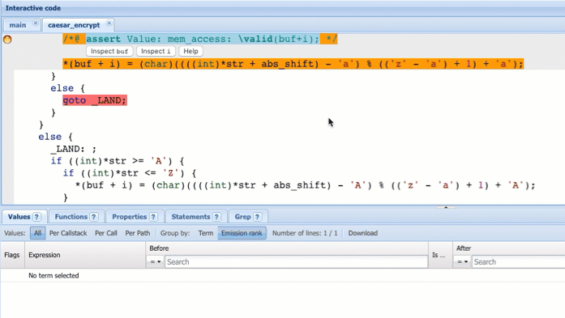
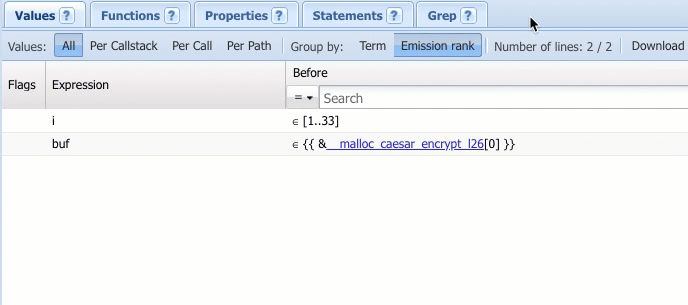
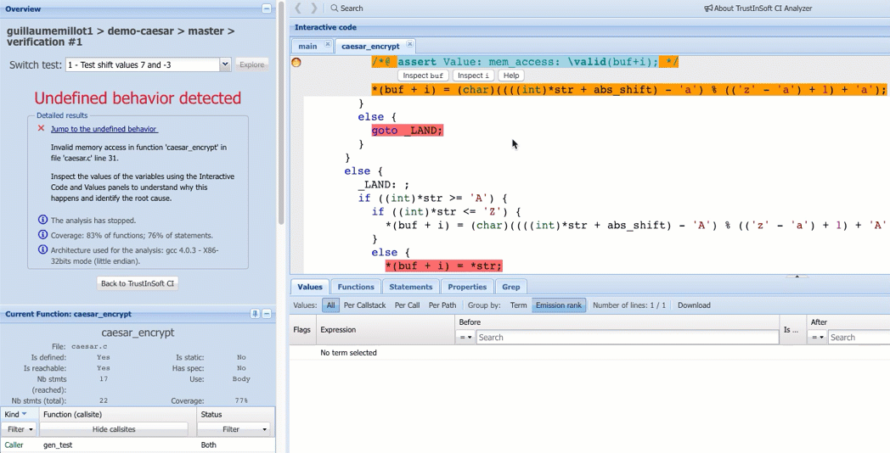

# Find the root cause of the undefined behavior

## Launch TrustInSoft CI Analyzer


In the following, we'll use TrustInSoft CI Analyzer to explore the behavior of the code along the tested path and find the root cause of the undefined behavior.


**1.** Still on the test, click on **Explore** to launch TrustInSoft CI Analyzer:

**2.** Once TrustInSoft CI Analyzer has launched, take a look at the interface:

* The **Overview panel** displays information about the test
* The **Interactive code panel** displays a "normalized" version of the code that preserves the semantics of the program
* The **Source code panel** shows the original source code

## Describe the undefined behavior

**1.** Observe how the **Interactive code panel** points to the undefined behavior:

The second line highlights the statement in the normalized code where the undefined behavior was found. The first line highlights the corresponding functional property, which TrustInSoft CI could not verify.


As part of the analysis process, TrustInSoft CI automatically annotates the code with ACSL functional properties starting with `assert Value`. These properties are written using the [ACSL specification language](https://en.wikipedia.org/wiki/ANSI/ISO_C_Specification_Language). They contain predicates, such as `\valid(buf+i)`, that TrustInSoft CI tries to verify to prove the absence of undefined behaviors.


Note the corresponding source code statement **line 31** in grey in the **Source code panel**:

Let's understand why the predicate `\valid(buf+i)` did not hold, by inspecting the variables `buf` and `i`.

**2.** In the **Interactive code panel**, click on `i` inside `\valid(buf+i)`, then look at the **Values widget** \(bottom\):

The widget displays the selected expression `i` along with the union of all its values until the undefined behavior was found. Since `i` gets incremented at each iteration of the `while` loop enclosing the undefined behavior, `i` takes several values so an integer range between 1 and 33.

**3.** Similarly, click on `buf` to look at its values in the **Values widget**:

`buf` is a pointer, whose value is the result of the call to `malloc` in the function `caesar_encrypt` line 26. The memory space allocated by `malloc` is represented using the symbolic notation `__malloc_caesar_encrypt_l26`.

**4.** You can click anywhere in the code on `i`, `buf` or any other expression, to see their values before and after the clicked statement in the **Values widget**:

**5.** Right click on `i` and select **Track this term**, then click on `buf`  to simultaneously inspect the values of `i`  and ~~`buf`~~ :

**6.** In the **Values widget**, click on the link **\_\_malloc\_caesar\_encrypt\_l26** to see its values. Then, click on the cell to expand it:

**7.** Click on **Per path** to look at the values of `i` and `__malloc_caesar_encrypt_l26`  for each iteration of the `while` loop enclosing the undefined behavior**:**

Each "master" row corresponds to one iteration of the loop. For example, the first row shows  `i = 1`, which means  that the statement with the undefined behavior is first reached when `i = 1`.

**8.** Click on **Emission rank** in the column headers, then **Sort Descending** to display the last loop iteration first, that is where the analysis stopped because of the undefined behavior:

In the last iteration \(top "master" row\) so right before the analysis stopped because of the undefined behavior, the code is accessing `buf` with an offset `i` equal to 33:

**9.** Finally, click on `__malloc_caesar_encrypt_l26` in the **Expression** column \(see above screenshot\) to see its type:

`__malloc_caesar_encrypt_l26` is an array of char of length 33 `(char [33])`.  The access with an offset of 33 is therefore out of bounds and it is an undefined behavior.

Let's find where the length of the array comes from.

## Find the root cause of the undefined behavior

**1.** In the **Interactive code panel**, right click on `buf`  inside the code statement below the functional property, then click on **Show Defs**.

The **Show Defs Statement widget** \(left\) moves up into view and displays the previous write statement to `buf` ****\(see video capture below\).

**2.** Click on this previous statement to point the **Interactive code panel** to it:

The problem is the integer literal 33 that is passed to `malloc`. Since `buf` contains the result of the encryption of `str`, the code should not allocate a buffer of constant size but one of the same size as `str`.


Whenever it is needed to understand where a value comes from, use **Show Defs** on this value and then recursively on the left-value of the previous statement, until you reach the root cause of the bad value.


## Summary

Before we fix the root cause of the undefined behavior, let's summarize what happened and what we did:

* TrustInSoft CI verifies the presence of undefined behaviors by propagating the test's input values, statement by statement, along the tested path. As part of the process, it computes for each statement the current "memory state", that can be roughly defined as the current value of all the variables. 
* We first analyzed the undefined behavior by inspecting the values of the variables at the program point where the undefined behavior was found. Then, we explored backwards the memory states, until we found the root cause of the undefined behavior. 
* We used the **Values widget** to isolate the program point where the undefined behavior occurred and to explore the values of the variables, and **Show Defs** to move to previous program points / memory states.

